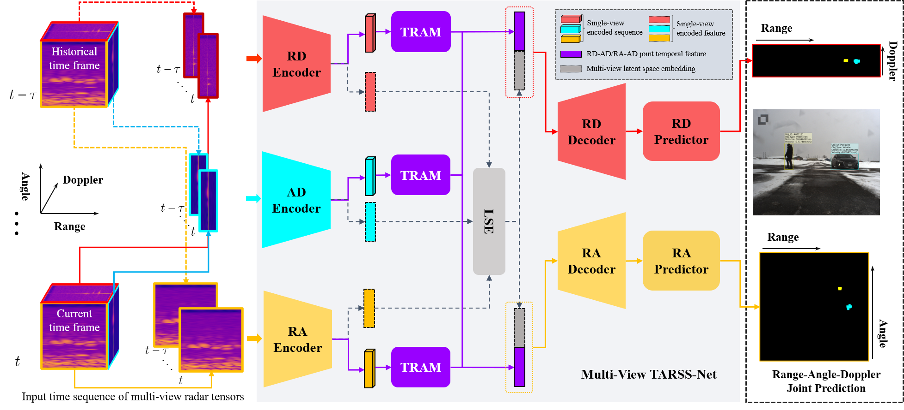

# TARSS-Net: Temporal-Aware Radar Semantic Segmentation Network

## Paper



Anon-Authors, TARSS-Net: Temporal-Aware Radar Semantic Segmentation Network, submitted to ACMMM 2022.


This repository is the implementation of TARSS-Net including TARSS-Net w/ Spatio-TRAP and TARSS-Net w/ Depth-TRAP.

Pls **note** that this anonymous repository is just for the rebuttal of ACMMM 2022.

The models are trained and tested on the [CARRADA dataset](https://arxiv.org/abs/2005.01456).

The CARRADA dataset is available at this link: [https://arthurouaknine.github.io/codeanddata/carrada](https://arthurouaknine.github.io/codeanddata/carrada).

## Installation

You can either use Docker with the provided [Dockerfile](./Dockerfile) containing all the dependencies, or follow these steps.

Clone or download the repo:

For Cloning:
```bash
$ git clone https://github.com/ArthurOuaknine/MVRSS.git
```

###Installation Steps
1. Install basic multi-view RSS network lib using pip:
```bash
$ cd TARSS/
$ pip install -e .
```

2. Install all the dependencies using pip or conda (taking ***pip*** as an example):
```bash
$ pip install numpy==1.20.3 Pillow>=8.1.1  
```
```bash
$ pip install scikit-image==0.18.3 scikit-learn==0.24.2 scipy==1.7.1
```
```bash
$ pip install tensorboard==2.6.0 torch==1.9.0 torchvision==0.10.0a0
```

## Running TARSS-Net

### Path Setup (Data & Logs)
1. Put the downloaded dataset "CARRADA" in your data dir, e.g., `/home/usrname/datasets`;
2. Specify the path for train/val logs, e.g., `/home/usrname/logs`;
3. Using ./utils/set_paths.py to set the data/log paths:

```bash
$ cd TARSS/mvrss/utils/
$ python set_paths.py --carrada /home/usrname/datasets --logs /home/usrnames/logs
```

### Training

Using training script `train.py` to train a model, this script will load the configuration info from a JSON config file, e.g., `config_files/tarssnet_v1.json`. The command line is as follows:

```bash
$ python train.py --cfg config_files/tarssnet_v1.json
```

**Note**: tarssnet\_v1 -> TARSS-Net w/ Depth-TRAP; tarssnet\_v2 -> TARSS-Net w/ Spatio-TRAP

### Testing

Actually, if you finished the training stage, the test results will also be calculated and saved in the log file. However, you can also just test the saved model using the script `test.py`.

Similar with the training stage, using the script `test.py` to evaluate the trained model as the following command line:

```bash
$ python test.py --cfg /home/logs/carrada/tarssnet_v1/name_of_the_model/config.json
```


## Acknowledgements
- Thank [CARRADA dataset](https://arxiv.org/abs/2005.01456) for providing the Radar dataset.
- Thank [MVRSS](https://arxiv.org/abs/2103.16214) for providing the basic model framework of multi-view RSS network. And we build our model using the basic framework of `mvrss` lib, our incremental modifications to the  `mvrss` code did not effect the TMVA-Net and MV-Net in MVRSS. 
- The paper is under review of the ACMMM2022, other special thanks will be mentioned after the final results.

## License

The TARSS-Net repo is released under the Apache 2.0 license.
